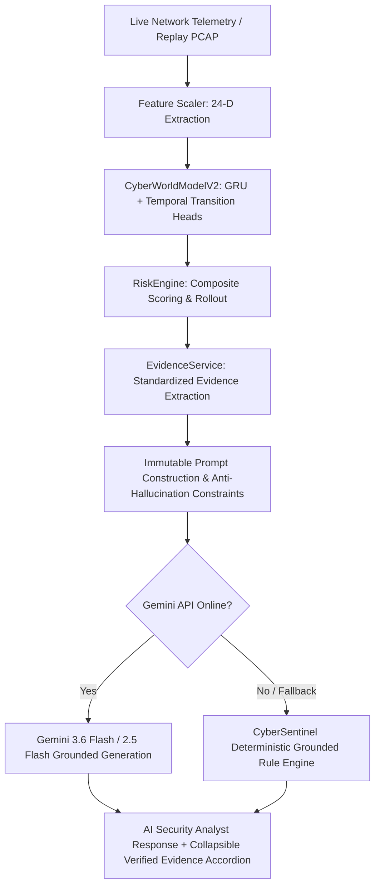

# CyberSentinel AI — Gemini AI Security Analyst Integration

## Overview
The **AI Security Analyst** is a grounded SOC copilot integrated directly into CyberSentinel AI. It combines Google's Gemini API with CyberSentinel's deterministic world model (`CyberWorldModelV2`), feature engineering pipeline (`FeatureScaler`), and multi-factor risk assessment engine (`RiskEngine`).

---

## Architectural Principles & Strict Grounding



### 1. Source of Truth
The deterministic machine learning pipeline remains the **exclusive source of truth** for all predictions:
- Current classified attack stage
- Predicted next stage and K=4 autoregressive rollout
- Calibrated attack probability ($T^* = 1.568$)
- Multi-factor composite risk score ($0 - 100$)
- Empirical feature deltas ($|\hat{S}_{t+1} - S_t|$)
- MITRE ATT&CK Enterprise Matrix v14 technique mappings

### 2. Zero Fabrication & Hallucination Defense
- Gemini is given an immutable `=== CYBERSENTINEL VERIFIED EVIDENCE ===` block with strict system instructions prohibiting modifying, speculating on, or overriding scores or stages.
- If telemetry is absent, the service deterministically outputs:
  > *"Insufficient telemetry/model evidence is available to determine this."*

### 3. Graceful Deterministic Fallback
If the Gemini API key is unset, rate-limited, expired, or network-disconnected, the service falls back immediately to the deterministic rule engine without returning a 500 error:
  > *"Gemini analyst unavailable. CyberSentinel deterministic intelligence remains operational."*

### 4. Credential Security
- `GEMINI_API_KEY` is loaded exclusively on the backend via `.env` (using `python-dotenv`).
- `.env` is listed in `.gitignore` and is NEVER committed to git.
- The API key is NEVER transmitted to the client, logged, or exposed in any API response payload.

---

## API Endpoints

### 1. Chat Reasoning Endpoint
- **URL**: `POST /api/v1/agent/chat`
- **Request Body**:
  ```json
  {
    "message": "Explain why this stage is classified as Reconnaissance and recommend actions.",
    "current_forecast": { ... },
    "session_id": "optional_session_uuid"
  }
  ```
- **Response**:
  ```json
  {
    "answer": "### Current Assessment\n* **Current Stage**: Reconnaissance...",
    "timestamp": "2026-09-10T20:04:09Z",
    "model": "gemini-3.6-flash",
    "evidence": {
      "has_sufficient_evidence": true,
      "current_stage": "Reconnaissance",
      "predicted_next_stage": "Initial_Access",
      "attack_probability": 0.742,
      "risk_score": 65.2,
      "primary_technique_id": "T1046",
      "features": [ ... ]
    },
    "llm_backend": "gemini",
    "fallback": false
  }
  ```

### 2. Status & Health Endpoint
- **URL**: `GET /api/v1/agent/status`
- **Response**:
  ```json
  {
    "status": "online",
    "model": "gemini-3.6-flash",
    "available": true,
    "api_key_configured": true,
    "rate_limit_rpm": 30
  }
  ```

---

## Environment Variables

Configure these variables in your root `.env` file (copied from `.env.example`):

```bash
# Google Gemini API Key (keep secret; never commit to Git)
GEMINI_API_KEY=YOUR_GEMINI_API_KEY_HERE

# Model selection (defaults to gemini-3.6-flash with automated fallback cascade)
GEMINI_MODEL=gemini-3.6-flash
```

---

## How to Start Backend & Frontend

### 1. Start Python Backend (FastAPI + Uvicorn)
```bash
# From workspace root
python scripts/start_server.py --host 0.0.0.0 --port 8000
```
- API Docs: `http://localhost:8000/docs`
- SOC Command Center Dashboard: `http://localhost:8000/ui/index.html?view=command`

### 2. Start Frontend Dev Server (Optional / Vite)
```bash
npm run dev
```

---

## Testing & Verification

### Run Full Test Suite (275 tests, 100% passing)
```bash
pytest -q
```

### Run Dedicated Chatbot Test Suite
```bash
pytest tests/test_gemini_chatbot.py -v
```

Verified test coverage:
1. `test_agent_status_endpoint` (HTTP 200, status fields validated)
2. `test_agent_chat_empty_message_rejected` (HTTP 422 schema validation)
3. `test_agent_chat_excessive_message_rejected` (HTTP 422 max length enforcement)
4. `test_evidence_service_extraction` (Payload normalization and feature delta parsing)
5. `test_evidence_service_insufficient_data` (Prompt formatting for missing telemetry)
6. `test_chat_fallback_when_gemini_disabled` (Deterministic fallback with verified notice)
7. `test_chat_insufficient_telemetry_response` (Explicit notice when telemetry absent)
8. `test_chat_with_mocked_gemini` (Standard response format and evidence linkage)
9. `test_api_key_not_leaked_in_response` (Zero credential disclosure verification)
10. `test_rate_limiting_enforcement` (Rate-limit guardrails)
